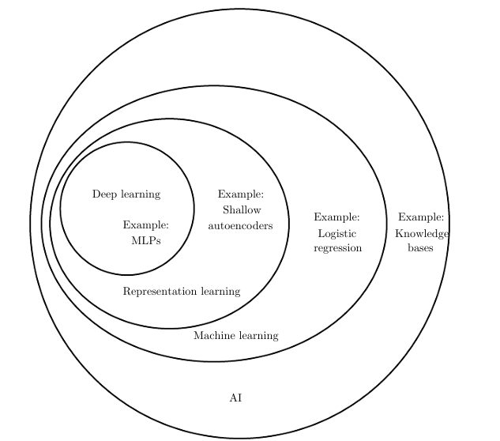

# Chapter 1

## General knowledge

Throughout the history, inventors always dreamed of machine that can think. This desire dated back to ancient Greece.

Abstract and formal tasks are amoung the most compliated tasks for humans beings but are easily solve by the computers. Meanwhile computers struggled to solve easy tasks like speeches and images recognition.

Many AI tasks can be easily solved by by designing the set of features to extract for that tasks, then providing them to a simple machine learning algorithm. But for some situations, we don't know the rigth features to extract like a tasks that should extract the numbers of cars in an images. 

## Definitions:

### Representation learning 
Representation learning is an approach that use machine learning to discover not only the mapping from representation to output but also the representation itself.
A representation learning algorithm can discover good set of features in less time that a group of researchers.
The best example of representation learning is **autoencoder**.
An **autoender** is a combinaison of an **encoder function** that converts input data into some differents representations and a **decoder function** converts the new representation back to the original form.
Autoencoder are trained to keep as much information as possible

### Deep Learning

**Deep learning** is a particular
kind of **machine learning** that achieves great power and flexibility by learning to
represent the world as a nested hierarchy of concepts, with each concept defined in
relation to simpler concepts, and more abstract representations computed in terms
of less abstract ones.
**Deep learning** allows the computer to build complex concepts out of simpler con
cepts.
One example of deep learning model is **mulitilayer perceptron**.
**A multilayer perceptron is just a mathematical function mapping some set of input values to output values.**
We can also think of deep learn as the depth that it create permits the computer to learn a multisetp computer program where each layer of the representation is the memory of the computer after excecuting instructions.
__Depth__ is the length of the longest path from input to output but depends on the definition of what constitutes a possible computational step. 
Deep learning back to the 1940's.  
So why deep learning is more efficience today than back then. It is because of the **increasing of datasets size** and the **increasing model sizes**

 Figure 1.2: Illustration of a deep learning model. 

Figure 1.4: A Venn diagram showing how deep learning is a kind of representation learning,
which is in turn a kind of machine learning, which is used for many but not all approaches
to AI.

### 1.2 Historical Trends in Deep Learning

Here are the key trends of deep learning:  

• Deep learning has had a long and rich history, but has gone by many names reflecting different philosophical viewpoints, and has waxed and waned in
popularity.  
• Deep learning has become more useful as the amount of available training
data has increased. 
• Deep learning models have grown in size over time as computer infrastructure
(both hardware and software) for deep learning has improved.  
• Deeplearning has solved increasingly complicated applications with increasing
accuracy over time.
